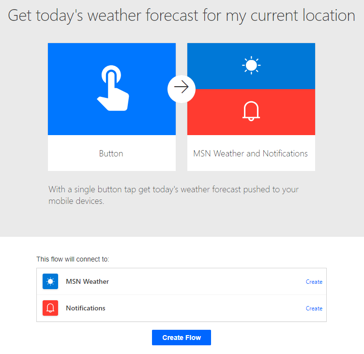

---
lab:
    title: 'Lab 1: Create cloud flows'
    module: 'Module 1: Get started with Power Automate'
---

# Practice Lab 1 – Create cloud flows

In this lab you will create cloud flows.

## What you will learn

- How to create Power Automate cloud flows from a template and with CoPilot
- How to create a Power Automate cloud flow from blank and add actions

## High-level lab steps

- Create a cloud flow from a template
- Create a cloud flow with CoPilot
- Create a cloud flow
- Monitor cloud flow activity
  
## Prerequisites

- Must have completed **Lab 0: Validate lab environment**

## Detailed steps

## Exercise 1 – Create a cloud flow from a template

### Task 1.1 - Select a template

1. Navigate to the Power Automate portal <https://make.powerautomate.com>.

1. If the **Welcome to Power Automate** popup dialog is displayed, select **Get started**.

1. Select the **Dev One** environment.

    

1. Select the **Templates** tab from the left-side menu.

1. Select the **Button** tab.

1. Enter `location` in the search field

    

1. Select **Get today's weather forecast for my current location**.

    

1. Select **Create** for **MSN Weather**.

1. Select **Create** for **Notifications**.

1. Select **Create Flow**.

1. If the **Your flow is ready to go** popup dialog is displayed, select **Don't show me this again** and select **Got it**.

    

### Task 1.2 - Run the flow

1. Select **Run**.

1. If prompted, select **Allow** for **Know your location**

1. Select **Continue**.

1. Select **Run flow**.

1. Select **Done**.

    

### Task 1.3 - Review the flow

1. Select the date and time in the flow run history.

    

1. Select the **Condition** step to expand the flow steps.

    

1. Select the **Get forecast for today** step with the green tick.

    

1. Select **Edit**

1. Select the **Condition** step to expand the flow steps.

1. Select **Expand condition**

1. Select one of the **Send a push notification** steps.

1. Select **Flow checker**. There should be no errors or warnings.

1. Close the **Flow checker** pane.

### Task 1.4 - Test the flow

1. Select **Test**, select **Automatically**, select **With a recently used trigger**, and then select the flow run.

    

1. Select **Test**.

1. Select the **<-** Back button from the top left of the command bar.

## Exercise 2 – Create a cloud flow with CoPilot

### Task 2.1 - Enter a prompt

1. Navigate to the Power Automate portal <https://make.powerautomate.com>.

1. Make sure you are in the **Dev One** environment.

1. Select the **Home** tab from the left-side menu.

1. Under **Let's automate something. What should it do?** enter `Every day send me an email with the daily summary from MSN Weather`.

    

1. Select **Generate**.

    

1. Select **Next**.

1. Select **Create flow**.

    

### Task 2.2 - Configure flow step

1. Select the **Get Forecast for today** step.

    

1. Enter `Seattle` for **Location**.

1. Select the **X** to clear **Units** and in the drop-down select **Imperial**

1. Select **Save**

1. Test the flow.

1. Select **Test**, select **Manually**, and then select **Test**.

1. Select the **<-** Back button from the top left of the command bar.

## Exercise 3 – Create a cloud flow from blank

### Task 3.1 - Create the trigger

1. Navigate to the Power Automate portal <https://make.powerautomate.com>.

1. Make sure you are in the **Dev One** environment.

1. Select the **+ Create** tab from the left-side menu.

1. Select **Automated cloud flow**.

1. Enter `Important email` for **Flow name**.

1. Enter `email` in search all triggers.

1. Select **When a new email arrives (V3)**.

    

1. Select **Create**.

### Task 3.2 - Configure the trigger

1. Select the **When a new email arrives (V3)** step.

1. Select **Show all**.

    

1. Select **No** for **Include attachments**.

1. Select **High** for **Importance**.

1. Select **Inbox** for **Folder**.

### Task 3.3 - Add an action

1. Select the **+** icon under the trigger step and select **Add an action**.

1. Enter `notification` in search.

    

1. Select **Post a feed notification** under **Microsoft Teams**.

1. Select **Sign in**.

1. Use your tenant credentials.

1. Select **Team** for **Notification Type**.

1. Enter your tenant user id for **Recipient**.

1. Select **Notification Text** field and select the Dynamic content icon.

    

1. Select **Subject**.

1. Select **Contoso** for **Team**.

1. Select **General** for **Channel**.

1. Select **Save**.

1. Select the **<-** Back button from the top left of the command bar.

## Exercise 4 – Monitor flows

### Task 4.1 - Cloud flow activity

1. Navigate to the Power Automate portal <https://make.powerautomate.com>.

1. Make sure you are in the **Dev One** environment.

1. Select **... More** from the left-side menu.

    

1. Select the pin icon for **Cloud flow activity**.

1. Select the **Cloud flow activity** tab from the left-side menu.

    
