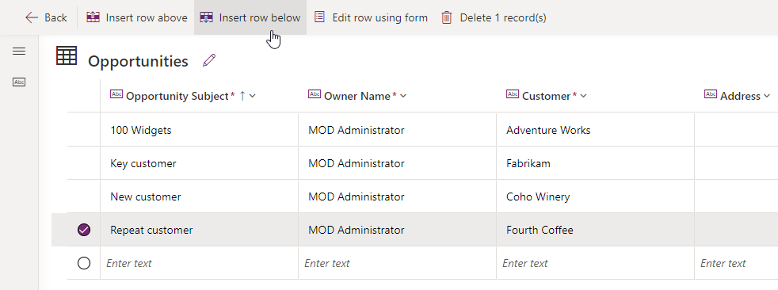

---
lab:
    title: 'Lab 2: Data model'
    module: 'Module 2: Get started with Microsoft Dataverse'
---

# Practice Lab 2 – Data model

In this lab you will create Dataverse tables and columns.

## What you will learn

- How to create tables and columns in Microsoft Dataverse
- How to create a relationship with a lookup column

## High-level lab steps

- Create a custom table
- Add columns to the table
- Create relationship to the by using a lookup column
  
## Prerequisites

- Must have completed **Lab 0: Validate lab environment**

## Detailed steps

## Exercise 1 – Create custom tables

### Task 1.1 - Create the Opportunity table

1. Navigate to the Power Apps Maker portal <https://make.powerapps.com>.

1. Make sure you are in the **Dev One** environment.

1. In the left navigation pane, select **Tables**.

1. Select **+ New table**, and select **Add columns and data**.

    

1. Select the **pencil** icon next to New table

    

1. Enter `Opportunity` for **Display name**.

1. Select **Save**.

### Task 1.2 - Primary column

1. Select the drop-down caret next to **New column** and select **Edit column**.

    

1. Enter `Opportunity Subject` for **Display name**.

1. Select **Update**.

1. Select **Create**.

### Task 1.3 - Add columns

1. In the **Opportunity columns and data** pane, select **+** to add a new column.

    

1. In the **New column** pane, enter or select the following values:

   1. Display name: `Owner Name`
   1. Data type: **Single line of text**
   1. Required: **Business required**

    

1. Select **Save**.

1. In the **Opportunity columns and data** pane, select **+** to add a new column.

1. In the **New column** pane, enter or select the following values:

   1. Display name: `Customer`
   1. Data type: **Single line of text**
   1. Required: **Business required**

1. Select **Save**.

1. In the **New column** pane, enter or select the following values:

   1. Display name: `Address`
   1. Data type: **Single line of text**
   1. Required: **Optional**

1. Expand **Advanced option** and enter `200` for **Maximum character count**.

1. Select **Save**.

1. In the **Opportunity columns and data** pane, select **+** and in the **New column** pane, enter or select the following values:

   1. Display name: `Estimated Close Date`
   1. Data type: **Date and time**
   1. Format: **Date only**
   1. Required: **Optional**

1. Select **Save**.

1. In the **Opportunity columns and data** pane, select **+** and in the **New column** pane, enter or select the following values:

   1. Display name: `Amount`
   1. Data type: **Currency**
   1. Required: **Optional**

1. Select **Save**.

1. In the **Opportunity columns and data** pane, select **+** and in the **New column** pane, enter or select the following values:

   1. Display name: `Notes`
   1. Data type: **Multiple lines of text**
   1. Format: **Text**
   1. Required: **Optional**

1. Select **Save**.

### Task 1.4 - Add choice column

1. In the **Opportunity columns and data** pane, select **+** and in the **New column** pane, enter or select the following values:

   1. Display name: `Status`
   1. Data type: **Choice**
   1. Required: **Optional**

1. Select **No** for **Sync with global choice?**

1. Enter `New` for **Label** and enter `1` for **Value**.

1. Select **+ New choice** and enter `Open` for **Label** and enter `2` for **Value**.

1. Select **+ New choice** and enter `Closed` for **Label** and enter `3` for **Value**.

1. Select **New** for **Default choice**.

    

1. Select **Save**.

## Exercise 2 – Create relationship

### Task 2.1 - Create a lookup column

1. Navigate to the Power Apps Maker portal <https://make.powerapps.com>.

1. Make sure you are in the **Dev One** environment.

1. In the left navigation pane, select **Tables**.

1. Select **Opportunity**.

1. In the **Opportunity columns and data** pane, select **+** and in the **New column** pane, enter or select the following values:

   1. Display name: `Account`
   1. Data type: **Lookup**
   1. Required: **Optional**
   1. Related table: **Account**

    

1. Select **Save**.

## Exercise 3 – Data

### Task 3.1 - Add opportunity records

1. Navigate to the Power Apps Maker portal <https://make.powerapps.com>.

1. Make sure you are in the **Dev One** environment.

1. In the left navigation pane, select **Tables**.

1. Select **Opportunity**.

1. In the **Opportunity columns and data** pane, select the drop-down caret next to **Edit** and select **Edit in new tab**.

1. Enter or select the following values:

   1. Opportunity Subject: `100 Widgets`
   1. Owner Name: `MOD Administrator`
   1. Customer: `Adventure Works`
   1. Estimated Close Date: **Pick a date in the previous month**
   1. Status: **Closed**
   1. Amount: `10,000`

1. Select **Inset row below** and enter or select the following values:

   1. Opportunity Subject: `Key customer`
   1. Owner Name: `MOD Administrator`
   1. Customer: `Fabrikam`
   1. Estimated Close Date: **Pick a future date in the current month**
   1. Status: **New**
   1. Amount: `50,000`

1. Select **Inset row below** and enter or select the following values:

   1. Opportunity Subject: `New customer`
   1. Owner Name: `MOD Administrator`
   1. Customer: `Coho Winery`
   1. Estimated Close Date: **Pick a future date in the next month**
   1. Status: **New**
   1. Amount: `25,000`

1. Select **Inset row below** and enter or select the following values:

   1. Opportunity Subject: `Repeat customer`
   1. Owner Name: `MOD Administrator`
   1. Customer: `Fourth Coffee`
   1. Estimated Close Date: **Pick a future date in the next month**
   1. Status: **Open**
   1. Amount: `15,000`

    

1. Close the edit data tab.
