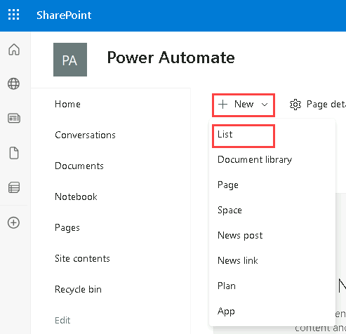
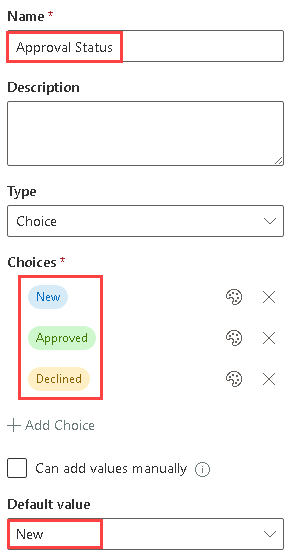
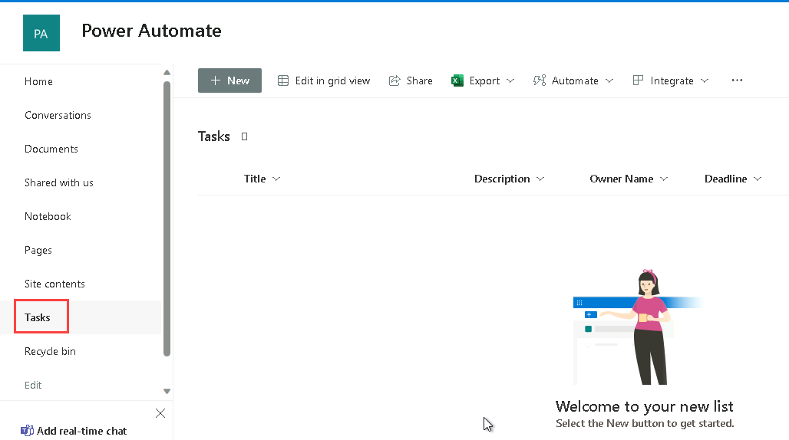
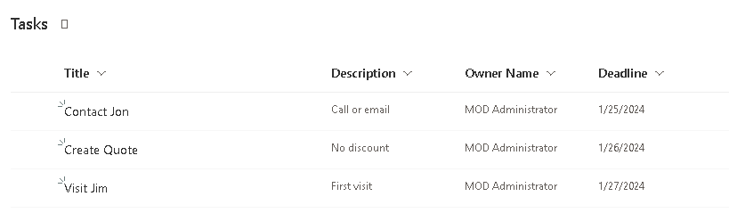

---
lab:
    title: 'Lab 3: SharePoint'
    module: 'Module 3: Build approval flows with Power Automate'
---

# Practice Lab 3 – SharePoint

In this lab you will create a SharePoint site and list.

## What you will learn

- How to create a SharePoint list
- How to upload data

## High-level lab steps

- Create a SharePoint list for Opportunities
  
## Prerequisites

- Must have completed **Lab 0: Validate lab environment**

## Detailed steps

## Exercise 1 – Create SharePoint list

### Task 1.1 Create a SharePoint site

1. In the [Power Apps maker portal](https://make.powerapps.com) select the **App launcher** in the top left of the browser window and then select **SharePoint**.

1. If the **Welcome to SharePoint Start Page** popup dialog is displayed, select **X** to close the dialog.

1. In SharePoint, select **+ Create site**.

1. Select **Team site**, select **Standard team** template, and select **Use template**.

1. Enter `Power Automate` for **Site name** and select **Next**.

1. Select **Create site**.

1. Select **Finish**.

1. If the **Start designing your site** popup dialog is displayed, close the dialog.

### Task 1.2 Create a SharePoint list

1. In the SharePoint site, select **+ New** and then select **List**.

    

1. Select **Blank list**

1. Enter `Tasks` for **Name**  and select **Create**.

1. Select **+ Add column**, select **Multiple lines of text**, and select **Next**.

1. In the **Create a column** pane, enter or select the following values:

   1. Name: `Description`
   1. Data type: **Multiple lines of text**

1. Select **Save**.

1. Select **+Add column**, select **Text**, and select **Next**.

1. In the **Create a column** pane, enter or select the following values:

   1. Name: `Owner Name`
   1. Data type: **Single line of text**

1. Select **Save**.

1. Select **+ Add column**, select **Date and time**, and select **Next**.

1. In the **Create a column** pane, enter or select the following values:

   1. Name: `Deadline`
   1. Data type: **Date and time**

1. Select **Save**.

1. Select **+ Add column**, select **Choice**, and select **Next**.

1. In the **Create a column** pane, enter or select the following values:

   1. Name: `Approval Status`
   1. Data type: **Choice**
   1. Choice 1=`New`
   1. Choice 2=`Approved`
   1. Choice 3=`Declined`

1. Select **New** for **Default value**

    

1. Select **Save**.

1. Copy the first part of the URL of the SharePoint site, for example `https://m365x99999999.sharepoint.com/sites/PowerAutomate/`

## Exercise 2 – Add data SharePoint list

### Task 2.1 - Add data

1. Navigate to the SharePoint site and select the **Tasks** list.

    

1. Select **+ New** and enter the following data and select **Save**:

   1. Title=`Contact Jon`
   1. Description=`Call or email`
   1. Owner Name=`MOD Administrator`
   1. Deadline=**Yesterday**
   1. Approval Status=**Declined**

1. Select **+ New** and enter the following data and select **Save**:

   1. Title=`Create Quote`
   1. Description=`No discount`
   1. Owner Name=`MOD Administrator`
   1. Deadline=**Today**
   1. Approval Status=**Approved**

1. Select **+ New** and enter the following data and select **Save**:

   1. Title=`Visit Jim`
   1. Description=`First visit`
   1. Owner Name=`MOD Administrator`
   1. Deadline=**Tomorrow**
   1. Approval Status=**New**

    
