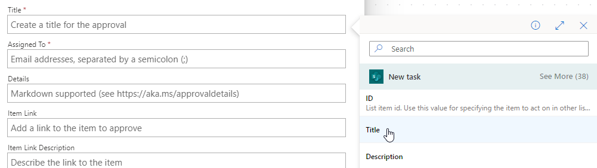

---
lab:
    title: 'Lab 4: Approval flow'
    module: 'Module 3: Build approval flows with Power Automate'
---

# Practice Lab 4 – Approval flow

In this lab you will create an approval flow.

## What you will learn

- How to create a Power Automate approvals cloud flow

## High-level lab steps

- Create an automated cloud flow for the SharePoint list
- Create an approval
- Add condition for approval outcome
- Test the flow
  
## Prerequisites

- Must have completed **Lab 3: SharePoint**

## Detailed steps

## Exercise 1 – Create approval flow

### Task 1.1 - Create the trigger

1. Navigate to the Power Automate portal <https://make.powerautomate.com>.

1. Make sure you are in the **Dev One** environment.

1. Select the **+ Create** tab from the left-side menu.

1. Select **Automated cloud flow**.

1. Enter `Task approval` for **Flow name**.

1. Enter `SharePoint` in search.

1. Select **When an item is created**.

1. Select **Create**.

### Task 1.2 - Configure the trigger

1. Select the **When an item is created** step.

1. Select the **When an item is created** step name and enter `New task`.

1. Select the **Power Automate SharePoint site** created in the previous lab. If the site is not listed, select **Enter custom value** and paste the URL of the Power Autmate SharePoint site

1. Select the **Tasks** list.

    

### Task 1.3 - Add approval action

1. Select the **+** icon under the trigger step and select **Add an action**.

1. Enter `approval` in search.

    

1. Select **Start and wait for an approval** under **Approvals**.

1. Select **Create New**.

1. Select **Approve/Reject - First to respond** for **Approval Type**

1. Select **Start and wait for an approval** step name and enter `Approval`.

1. Select **Title** field and select the Dynamic content icon.

    

1. Select **Title**.

1. Enter your tenant user id for **Assigned To**.

1. Select **Details** field and select the Dynamic content icon.

1. Select **Description**.

1. Select **Item Link** field and select the Dynamic content icon and select **See More**.

1. Select **Link to item**.

### Task 1.4 - Add condition

1. Select the **+** icon under the approval step and select **Add an action**.

1. Enter `condition` in search.

1. Select **Condition** under **Control**.

1. Select the left-hand **Choose a value** field and select the Dynamic content icon.

    

1. Select **Outcome**.

1. Select **is equal to** for **Operator**.

1. Select the right-hand **Choose a value** field and enter `Approve`.

    

### Task 1.5 - Update status actions

1. Select the **+** icon under **True** and select **Add an action**.

1. Enter `update item` in search.

1. Select **Update Item** under **SharePoint**.

1. Select **Update item** step name and enter `Set task to approved`.

1. Select the **Power Automate SharePoint site**.

1. Select the **Tasks** list.

1. Select **Id** field and select the Dynamic content icon.

1. Select **Id** from **New task**.

1. Select **Show all**.

1. Select **Title** field and select the Dynamic content icon.

1. Select **Title** from **New task**.

1. Select **Approved** for **Approval Status Value**.

1. Select the **+** icon under **False** and select **Add an action**.

1. Enter `update item` in search.

1. Select **Update Item** under **SharePoint**.

1. Select **Update item 1** step name and enter `Set task to declined`.

1. Select the **Power Automate SharePoint site**.

1. Select the **Tasks** list.

1. Select **Id** field and select the Dynamic content icon.

1. Select **Id** from **New task**.

1. Select **Show all**.

1. Select **Title** field and select the Dynamic content icon.

1. Select **Title** from **New task**.

1. Select **Declined** for **Approval Status Value**.

1. Select **Save**.

1. Select the **<-** Back button from the top left of the command bar.

## Exercise 2 – Test approval

### Task 2.1 - Trigger approval flow

1. Navigate to the SharePoint site and select the **Tasks** list.

1. Select **+ New** and enter the following data and select **Save**:

   1. Title=`Approval test`
   1. Description=`Test`
   1. Owner Name=`MOD Administrator`
   1. Deadline=**Today**
   1. Approval Status=**New**

### Task 2.2 - Progress approval

1. Navigate to the Power Automate portal <https://make.powerautomate.com>.

1. Make sure you are in the **Dev One** environment.

1. Select the **My flows** tab from the left-side menu.

1. Select **Task approval**.

1. Select the date and time in the flow run history.

    > **Note:** The Approvals functionality will be install in the background. This will take approximately 10 minutes.

1. Select the **Approvals** tab from the left-side menu.

    

1. Select the **Approval test**, select the **Tick**, and select **Confirm**.

1. Select **Done**.

1. Select the **My flows** tab from the left-side menu.

1. Select **Task approval**.

1. Select the date and time in the flow run history.

1. Navigate to the SharePoint site and select the **Tasks** list.

1. Verify that the **Approval status** of the **Approval test** item is **Approved**.
