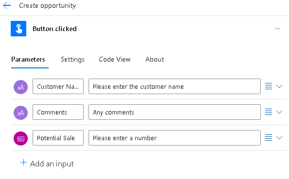
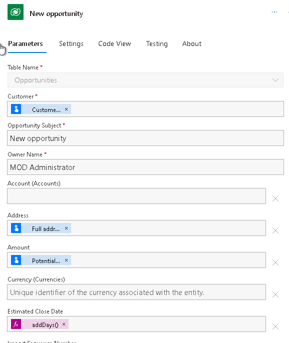

---
lab:
    title: 'Lab 5: Button flow'
    module: 'Module 4: Build flows to manage user information'
---

# Practice Lab 5 – Button flow

In this lab you will create a button flow.

## What you will learn

- How to create a Power Automate instant button flow

## High-level lab steps

- Create a button flow
- Use trigger tokens
- Add user input
- Test the flow
  
## Prerequisites

- Must have completed **Lab 2: Data model**

## Detailed steps

## Exercise 1 – Create button flow

### Task 1.1 - Create the trigger

1. Navigate to the Power Automate portal <https://make.powerautomate.com>.

1. Make sure you are in the **Dev One** environment.

1. Select the **+ Create** tab from the left-side menu.

1. Select **Instant cloud flow**.

1. Enter `Create opportunity` for **Flow name**.

1. Select **Manually trigger a flow**.

1. Select **Create**.

### Task 1.2 - Add user input

1. Select the **Manually trigger a flow** step.

1. Select the **Manually trigger a flow** step name and enter `Button clicked`.

1. Select **Add an input**.

1. Select **Text**

1. Enter `Customer Name` in **Input**.

1. Enter `Please enter the customer name` in **Please enter your input**.

1. Select **Add an input**.

1. Select **Text**

1. Enter `Comments` in **Input**.

1. Enter `Any comments` in **Please enter your input**.

1. Select **Add an input**.

1. Select **Number**

1. Enter `Potential Sale` in **Input**.

    

### Task 1.3 - Add create opportunity action

1. Select the **+** icon under the trigger step and select **Add an action**.

1. Enter `add row` in search.

1. Select **Add a new row** under **Dataverse**.

1. Select **Sign In**

1. Use your tenant credentials.

1. Select **Add a new row** step name and enter `New opportunity`.

1. Select **Opportunities** for **Table Name**

1. Select **Customer** field and select the Dynamic content icon and select **See More**.

1. Select **Customer Name**.

1. Select **Opportunity Subject** field and enter `New opportunity`.

1. Select **Owner Name** field and enter `MOD Administrator`.

1. Select **Show all**.

1. Select **Amount** field and select the Dynamic content icon.

1. Select **Potential Sale**.

1. Select **Notes** field and select the Dynamic content icon and select **See More**.

1. Select **Comments**.

1. Select **Estimated Close Date** field and select the expression icon.

1. Enter the expression `addDays(utcNow(),30)` and select **Add**.

    

1. Select **Save**.

## Exercise 2 – Test button flow

### Task 2.1 - Run button flow

1. Select **Test**

1. Select **Manually**.

1. Select **Test**.

    

1. Enter the following details:

   1. Customer Name=`Button test`
   1. Comments=`This is a test`
   1. Potential Sale=`9999`

1. Select **Run flow**.

1. Select **Done**.

1. Select the **<-** Back button from the top left of the command bar.

### Task 2.2 - Verify opportunity record created

1. Navigate to the Power Apps Maker portal <https://make.powerapps.com>.

1. Make sure you are in the **Dev One** environment.

1. In the left navigation pane, select **Tables**.

1. Select **Opportunity**.
