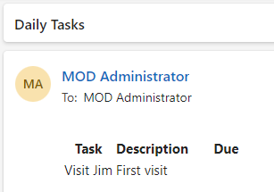

---
lab:
    title: 'Lab 6: Scheduled flow'
    module: 'Module 5: Power Automate's deep integration across multiple data sources'
---

# Practice Lab 6 – Scheduled flow

In this lab you will create a scheduled flow.

## What you will learn

- How to create a Power Automate scheduled flow and process a list of SharePoint items.

## High-level lab steps

- Create a scheduled flow
- Query SharePoint list
- Use data operations
- Test the flow
  
## Prerequisites

- Must have completed **Lab 3: SharePoint**

## Detailed steps

## Exercise 1 – Create scheduled flow

### Task 1.1 - Create the trigger

1. Navigate to the Power Automate portal <https://make.powerautomate.com>.

1. Make sure you are in the **Dev One** environment.

1. Select the **+ Create** tab from the left-side menu.

1. Select **Scheduled cloud flow**.

1. Enter `Daily New Tasks` for **Flow name**.

1. Select **Day**.

    

1. Select **Create**.

### Task 1.2 - Configure the trigger

1. Select the **Recurrence** step.

1. Select the **Recurrence** step name and enter `Daily`.

### Task 1.3 - Query new tasks

1. Select the **+** icon under the trigger step and select **Add an action**.

1. Enter `list items` in search.

1. Select **Get items** under **SharePoint**.

1. Select **Get items** step name and enter `New tasks`.

1. Select the **Power Automate SharePoint site**.

1. Select the **Tasks** list.

1. Select **Show all**.

1. Select the **Filter Query** field and enter `ApprovalStatus eq 'New'`

    

### Task 1.4 - Select columns

1. Select the **+** icon under the New Tasks step and select **Add an action**.

1. Enter `Select` in search.

1. Select **Built-in** for **Runtime**.

1. Select **Select** under **Data Operations**.

1. Select **From** field and select the Dynamic content icon.

1. Select **body/value** from **New tasks**.

1. Select **Enter key** field and enter `Task`.

1. Select **Enter value** field, select the Dynamic content icon.

1. Select **Title** from **New tasks**.

1. Select **Enter key** field and enter `Description`.

1. Select **Enter value** field, select the Dynamic content icon.

1. Select **Description** from **New tasks**.

1. Select **Enter key** field and enter `Due`.

1. Select **Enter value** field, select the Dynamic content icon and select **See More**.

1. Select **Deadline** from **New tasks**.

    

1. If the flow designer has automatically added one or more For Each loops, drag the Select step outside of the loops and delete the loop(s).

    

### Task 1.5 - Create table

1. Select the **+** icon under the Select step and select **Add an action**.

1. Enter `create html` in search.

1. Select **Create HTML table** under **Data Operations**.

1. Select **Create HTML table** step name and enter `Format as HTML table`.

1. Select **From** field and select the Dynamic content icon.

1. Select **Output** from **Select**.

    

### Task 1.6 - Send email

1. Select the **+** icon under the Create HTML table step and select **Add an action**.

1. Enter `email` in search.

1. Select **Send an email (V2)** under **Office 365 Outlook**.

1. Select **Send an email (V2)** step name and enter `Notify by email`.

1. Select **To** field and select **Enter custom value**.

1. Enter your tenant user id for **To**.

1. Select **Subject** field and enter `Daily Tasks`.

1. Select **Body** field and select the Dynamic content icon.

1. Select **Output** from **Format as HTML table**.

1. Select **Save**.

## Exercise 2 – Test scheduled flow

### Task 2.1 - Run scheduled flow manually

1. Select **Test**

1. Select **Manually**.

1. Select **Test**.

1. Select **Run flow**.

1. Select **Done**.

1. In the Power Automate portal, select the **App launcher** in the top left of the browser window and then select **Outlook**.

    
