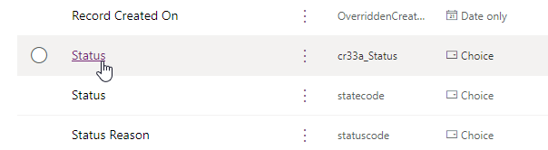

---
lab:
    title: 'Lab 7: Trigger filters'
    module: 'Module 5: Power Automate's deep integration across multiple data sources'
---

# Practice Lab 7 – Trigger filters

In this lab you will filter on an update trigger.

## What you will learn

- How to filter triggers

## High-level lab steps

- Create an automated flow
- Add column filter
- Add query filter

## Prerequisites

- Must have completed **Lab 2: Data model**

## Detailed steps

## Exercise 1 - Schema name

### Task 1.1 - Column schema name

1. Navigate to the Power Apps Maker portal <https://make.powerapps.com>.

1. Make sure you are in the **Dev One** environment.

1. In the left navigation pane, select **Tables**.

1. Select **Opportunity**

1. Under **Schema**, select **Columns**.

1. Select the **Status** column.

    

1. Expand **Advanced options**.

    

1. Copy the **logical name** for use in the flow.

   > **Note:** The prefix for your status column may be different.

## Exercise 2 – Create automated flow

### Task 2.1 - Create the trigger

1. Navigate to the Power Automate portal <https://make.powerautomate.com>.

1. Make sure you are in the **Dev One** environment.

1. Select the **+ Create** tab from the left-side menu.

1. Select **Automated cloud flow**.

1. Enter `Opportunity Closed` for **Flow name**.

1. Enter `Dataverse` in search all triggers.

1. Select **When a row is added, modified, or deleted**.

1. Select **Create**.

### Task 2.2 - Configure the trigger

1. Select the **When a row is added, modified, or deleted** step.

1. Select the **When a row is added, modified, or deleted** step name and enter `Opportunity changed`.

1. Select **Modified** for **Change Type**.

1. Select **Opportunities** for **Table Name**

1. Select **Organization** for **Scope**

    

### Task 2.3 - Send email

1. Select the **+** icon under the trigger step and select **Add an action**.

1. Enter `email` in search.

1. Select **Send an email (V2)** under **Office 365 Outlook**.

1. Select **Send an email (V2)** step name and enter `Notify by email`.

1. Select **To** field and select **Enter custom value**.

1. Enter your tenant user id for **To**.

1. Select **Subject** field and enter `Opportunity closed`.

1. Select **Body** field and select the Dynamic content icon.

1. Select **Opportunity Subject** from **Opportunity changed**.

1. Select **Body** field and select the Dynamic content icon and select **See More**.

1. Select **Status** from **Opportunity changed**.

### Task 2.4 - Column filter

1. Select the **Opportunity changed** trigger step.

1. Select **Show all**

1. Select the **Select Columns** field and enter `cr977_status`

   > **Note:** The prefix for your status column will be different.

### Task 2.5 - Row filter

1. Select the **Opportunity changed** step.

1. Select **Show all**

1. Select the **Filter Rows** field and enter `cr977_status eq 3`

    

    > **Note:** The prefix for your status column will be different.

1. Select **Save**.

1. Select the **<-** Back button from the top left of the command bar.
